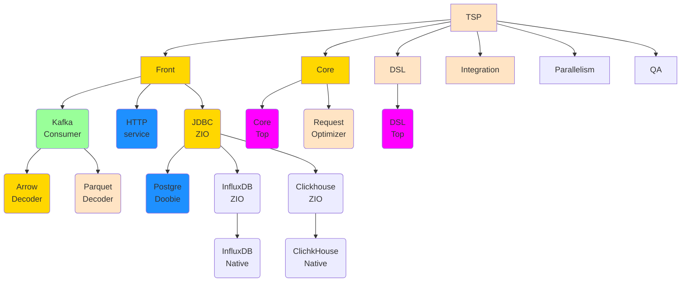

# TSP Status Report

## Color Encoding
Blank     - Not Started, Not implemented  
Green     - Done  
Blue      - Graduates Work  
Bisque    - Alfa  
Gold      - Beta  
Orange    - Release Candidate  
Magenta   - Reused

