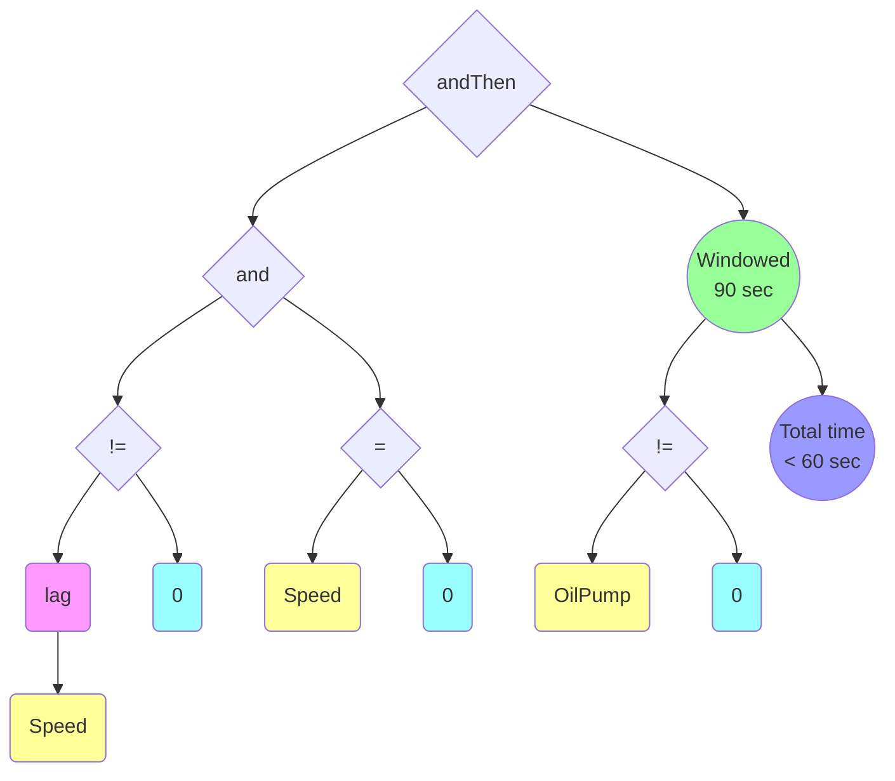

<<<<<<< HEAD

=======
# TSP Status Report
>>>>>>> master

```mermaid
graph TD;  

  %% Top level
  TSP --> Front
  TSP --> Core
  TSP --> DSL
<<<<<<< HEAD
=======
  TSP --> Integration
  TSP --> Parallelism
>>>>>>> master
  TSP --> QA
  TSP --> Integration
  TSP --> Perf(Performance<br>Tuning)
  
  %% Datapath
  Front --> Kafka(Kafka<br>Consumer)
  Kafka --> Arrow(Arrow<br>Decoder)
  Kafka --> Parquet(Parquet<br>Decoder)  

  %% HTTP
  Front --> http(HTTP<br>service)

  %% JDBC
<<<<<<< HEAD
  Front --> JDBC(JDBC<br> Doobie)
  JDBC --> Postgre(PostgreSQL<br>Doobie)
  JDBC --> WrapIF(InfluxDB<br>Doobie)
  JDBC --> WrapCH(Clickhouse<br>Doobie)
  WrapIF --> Influx(InfluxDB<br>Native)
  WrapCH --> ClickHouse(ClichkHouse<br>Native)

  %% Core
  Core --> CoreWrap(ZIO Wrap)
  CoreWrap --> CoreMonad(Core<br>Monad)
  Core --> Par(Parallelism)
  Par --> Scheduler
  Par --> Cache

  %% DSL
  DSL --> WrapDSL(ZIO Wrap)
  WrapDSL --> DslMonad(DSL<br>Monad);
   
  %% Styling

  %% Ready
  style Kafka fill:lightgreen
  style Parquet fill:lightgreen
  style Pandas fill:lightgreen

  %% Early Stage  
  style CoreWrap fill:#ff9
  style Clover fill:#ff9

  %% Late Stage
  style http fill:cyan
  style Postgre fill:cyan
    
  %% Reused
  style CoreMonad fill:magenta
  style DslMonad fill:magenta

  %% Freelance
  style JDBC fill:red
  style WrapIF fill:red
  style WrapCH fill:red
  
```

## Design plan 

1. Stage 0: Basic Datapath build <br>
Kafka -> Parquet -> Pandas -> Clover Decoder on input 
Kafka write on output <br>

2. Stage 1: Basic Rules Build <br>
Stage 0 + Rules integration ( DSL + Core )

3. Stage 2: PostgreSQL build <br>
Stage 1 + Write sink to Postgres  <br>

4. Stage 3: InfluxDB build <br>
Stage 2 + InfluxDB <br>

5. Stage 4: Alfa release <br>
**Aug 12 2019**

6. Troubleshooting

7. Delivery <br>
**Aug 31 2019**
=======
  Front --> JDBC(JDBC<br> ZIO)
  JDBC --> Postgre(Postgre<br>Doobie)
  JDBC --> WrapInflux(InfluxDB<br>ZIO)
  JDBC --> WrapCH(Clickhouse<br>ZIO)
  WrapInflux --> Influx(InfluxDB<br>Native)
  WrapCH --> ClickHouse(ClichkHouse<br>Native)

  %% Core
  Core --> CoreWrap(Core<br> Top)
  Core --> ReqOpt(Request<br> Optimizer)

  %% DSL
  DSL --> DslTop(DSL<br>Top);
  
  %% Styling

  %% Ready
  style Kafka fill:#9f9
  
  %% Grads 
  style Postgre fill:dodgerblue
  style http fill:dodgerblue

  %% Alfa Stage
  style TSP fill:bisque
  style DSL fill:bisque  
  style Integration fill:bisque
  style ReqOpt fill:bisque
  style Parquet fill:bisque
  
  %% Beta Stage
  style Arrow fill:gold
  style Front fill:gold
  style JDBC fill:gold
  style Core fill:gold
  
  %% Release Candidate

  %% Reused
  style CoreWrap fill:magenta
  style DslTop fill:magenta
  
```
## Color Encoding
Blank     - Not Started, Not implemented <br>
Green     - Done <br>
Blue      - Graduates Work <br>
Bisque    - Alfa <br>
Gold      - Beta <br>
Orange    - Release Candidate <br>
Magenta   - Reused

>>>>>>> master
