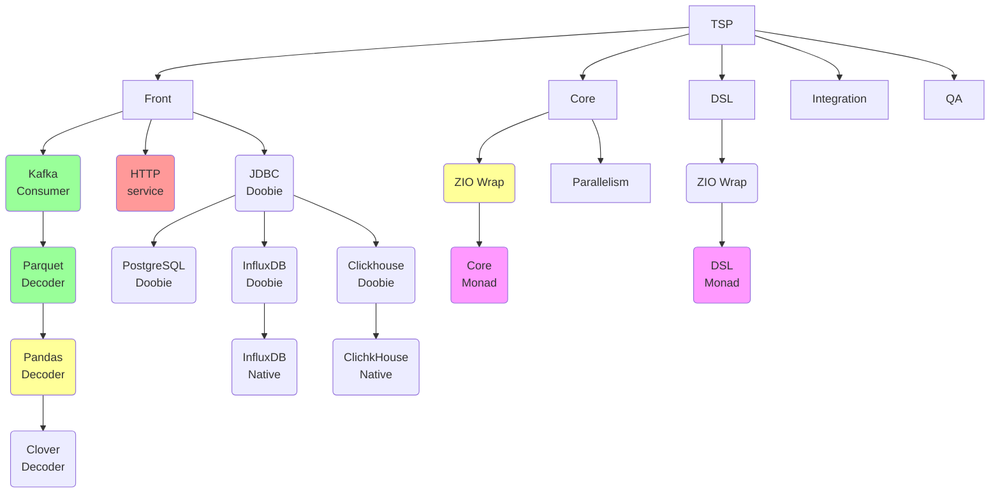

# TSP tasks

## Color encoding
1. Green - Done
2. Yellow - Early stage dev
3. Orange - Late stage dev
4. Magenta - Reused

```mermaid
graph TD;  

  %% Top level
  TSP --> Front
  TSP --> Core
  TSP --> DSL
  TSP --> Integration
  TSP --> QA
  
  %% Datapath
  Front --> Kafka(Kafka<br>Consumer)
  Kafka --> Parquet(Parquet<br>Decoder)
  Parquet --> Pandas(Pandas<br>Decoder)
  Pandas --> Clover(Clover<br>Decoder)

  %% HTTP
  Front --> http(HTTP<br>service)

  %% JDBC
  Front --> JDBC(JDBC<br> Doobie)
  JDBC --> Postgre(PostgreSQL<br>Doobie)
  JDBC --> WrapInflux(InfluxDB<br>Doobie)
  JDBC --> WrapCH(Clickhouse<br>Doobie)
  WrapInflux --> Influx(InfluxDB<br>Native)
  WrapCH --> ClickHouse(ClichkHouse<br>Native)

  %% Core
  Core --> CoreWrap(ZIO Wrap)
  CoreWrap --> CoreMonad(Core<br>Monad)
  Core --> Parallelism

  %% DSL
  DSL --> WrapDSL(ZIO Wrap)
  WrapDSL --> DslMonad(DSL<br>Monad);
  
  %% Styling

  %% Ready
  style Kafka fill:#9f9
  style Parquet fill:#9f9

  %% Early Stage
  style Pandas fill:#ff9
  style CoreWrap fill:#ff9

  %% Late Stage
  style http fill:#f99
    
  %% Reused
  style CoreMonad fill:#f9f
  style DslMonad fill:#f9f
  
```
